# UFCU Online Account Application — current flow

Reconstructed from `UFCU Online account application 2026.mp4` (3:29) via the 30 frames in `screens/`.
Two distinct systems: the **ufcu.org marketing site** and the **Narmi-hosted application**
(footer reads "Powered by Narmi", separate domain/shell, own language switcher).

```mermaid
flowchart TD
    %% ---------- ufcu.org ----------
    subgraph MKT["ufcu.org — marketing site"]
        A["Homepage<br/><i>step 01</i>"] --> B["Become A Member"]
        B --> C["Eligibility gate<br/>Select employer / school from dropdown<br/>ACC · UT Austin · Texas State · YMCA · Goodwill · …<br/><i>step 02</i>"]
        C -.->|"no affiliation"| C2["Join via American Consumer Council<br/>for free — radio option"]
        C --> D["Side panel: What You'll Need<br/>18+ · driver license or state ID · SSN/ITIN"]
        C2 --> D
        D --> E{"Meets requirements?"}
        E -->|"No"| OFF["Off-ramp: schedule branch appointment<br/>or call 512-467-8080"]
        E -->|"Yes"| F["Continue"]
    end

    F --> G

    %% ---------- Narmi application ----------
    subgraph APP["Narmi application"]
        G["Tell us about yourself<br/><i>step 03</i>"]
        G -->|"I'm a new member"| S1
        G -.->|"I'm a current member"| CUR["Current-member path<br/><i>not captured in video</i>"]
        G -.->|"Already started an application? Continue"| RESUME["Resume saved application<br/><i>not captured in video</i>"]

        %% Step 1
        subgraph P1["1 · Your details"]
            S1["Yes/No gate above the form<br/><i>label not legible in capture</i><br/><i>step 04</i>"]
            S1 --> S1a["Personal details<br/>name · SSN/ITIN · DOB · occupation · email · mobile"]
            S1a --> S1b["W-9 / perjury certification checkbox"]
            S1b --> S1c["Residential address + state + zip"]
            S1c --> S1d{"Mailing address<br/>same as residential?"}
            S1d -->|"Yes — checked"| S1e
            S1d -.->|"No"| S1d2["Separate mailing address fields<br/><i>not captured</i>"] --> S1e
            S1e["reCAPTCHA — I'm not a robot<br/>image challenge on failure<br/><i>steps 05–06</i>"]
            S1e --> S1f["USA PATRIOT Act notice · Next<br/><i>step 07</i>"]
        end

        %% Step 2
        S1f --> S2
        subgraph P2["2 · Account selection"]
            S2["Choose your accounts<br/>tabs: Recommended · Checking · Savings · Money Market · Certificates<br/><i>step 08</i>"]
            S2 --> S2a["Cards: Free Checking · Plus Checking · Savings · Simply U™<br/>each with Explore More / More details"]
            S2a --> S2b["Your selection summary · Back / Next<br/><i>step 09</i>"]
        end

        %% Step 3
        S2b --> S3
        subgraph P3["3 · Funding"]
            S3{"Do you want to fund<br/>your account now?<br/><i>step 10</i>"}
            S3 -->|"Yes"| S3a["Choose a funding method<br/><i>step 11</i>"]
            S3a --> M1["Log in with your bank — $54,500 max<br/>modal: Select your institution, searchable<br/><i>step 12</i>"]
            S3a --> M2["Use your account number — $54,500 max<br/>modal: routing · account # · Checking/Savings<br/>EFT agreement<br/><i>steps 13–14</i>"]
            S3a --> M3["Use a credit/debit card — $2,500 max<br/>modal: Visa/MC/Discover · card · exp · CVC · billing zip<br/><i>steps 15–16</i>"]
            M1 --> S3b
            M2 --> S3b
            M3 --> S3b
            S3b["Enter funding amounts per account<br/>$0 minimum each · withdrawn 1–2 business days after approval"]
            S3 -->|"No"| S3c
            S3b --> S3c["Refer-A-Friend code — optional<br/>Back / Next<br/><i>steps 17–18</i>"]
        end

        %% Step 4
        S3c --> S4gate{"Checking account selected?"}
        S4gate -->|"No"| S5
        S4gate -->|"Yes — Preferences step appears in sidebar"| S4
        subgraph P4["4 · Preferences — conditional"]
            S4["Debit card toggle per checking account<br/>Visa debit · 7–10 business days<br/><i>step 19</i>"]
            S4 --> S4a["Pick a design<br/>UFCU · Texas State · UT Longhorn"]
            S4a --> S4b["Courtesy pay opt-in toggle<br/>$35/transaction · repay within 45 days<br/><i>step 20</i>"]
        end

        %% Step 5
        S4b --> S5
        subgraph P5["5 · Disclosures"]
            S5["ESign consent — gate 1<br/>link opens 4-page PDF in browser viewer<br/><i>steps 21–22</i>"]
            S5 --> S5a["Checkbox 1: consent to ESign"]
            S5a --> S5b["Reveals 11 disclosure links<br/>Spanish Language · Membership &amp; Account Agreement, 25pp<br/>Truth In Savings · EFT Reg E · Funds Availability<br/>Wire Transfer · Privacy · Arbitration · Fee Schedule<br/>Rate Sheet · Overdraft Service<br/><i>steps 24–25</i>"]
            S5b --> S5c["Checkbox 2: consent to Membership Agreement,<br/>Fee Schedule &amp; Deposit Rates · Next<br/><i>step 26</i>"]
        end

        %% Step 6
        S5c --> S6["6 · Review your application<br/>per-section Edit links back into each step<br/><i>step 27</i>"]
        S6 --> S7["Submitting your application…<br/>up to 1 minute, blocking<br/><i>step 28</i>"]
    end

    S7 --> OUT{"Decision"}
    OUT -->|"Approved"| APPR["You've been approved!<br/>account · direct deposit · routing numbers per account<br/><i>steps 29–30</i>"]
    OUT -.->|"Declined / manual review"| MAN["<i>not captured in video</i>"]
    APPR --> ENROLL["Ready for the next step? → Enroll Now<br/>hands off to digital banking enrollment"]

    classDef unseen stroke-dasharray: 5 5,color:#888
    class CUR,RESUME,S1d2,MAN unseen
```

## Step index

| # | Screen | Frame |
|---|---|---|
| 1 | ufcu.org homepage | `step_01_t0001.5s.png` |
| 2 | Eligibility — employer/school dropdown + What You'll Need | `step_02_t0008.0s.png` |
| 3 | Tell us about yourself — new / current / resume | `step_03_t0019.0s.png` |
| 4 | Your details — personal details form | `step_04_t0042.5s.png` |
| 5 | reCAPTCHA image challenge | `step_05_t0064.5s.png` |
| 6 | Address complete, captcha passed | `step_06_t0072.5s.png` |
| 7 | PATRIOT Act notice · Next | `step_07_t0074.0s.png` |
| 8 | Choose your accounts — product tabs | `step_08_t0076.5s.png` |
| 9 | Your selection summary | `step_09_t0111.5s.png` |
| 10 | Fund your accounts — Yes/No | `step_10_t0114.5s.png` |
| 11 | Choose a funding method — 3 options | `step_11_t0116.5s.png` |
| 12 | Link a bank account — institution picker | `step_12_t0123.0s.png` |
| 13 | Funding method: account number selected | `step_13_t0126.5s.png` |
| 14 | Link your bank account — manual entry modal | `step_14_t0128.5s.png` |
| 15 | Funding method: card selected | `step_15_t0130.0s.png` |
| 16 | Add a credit/debit card modal | `step_16_t0131.0s.png` |
| 17 | Back to funding Yes/No | `step_17_t0134.5s.png` |
| 18 | Funding = No → Refer-A-Friend only | `step_18_t0136.5s.png` |
| 19 | Preferences — debit card + design | `step_19_t0141.5s.png` |
| 20 | Courtesy pay toggle · Next | `step_20_t0148.0s.png` |
| 21 | Review disclosures — ESign gate | `step_21_t0151.0s.png` |
| 22 | ESIGN consent PDF viewer, 4pp | `step_22_t0156.0s.png` |
| 23 | Back on disclosures | `step_23_t0157.0s.png` |
| 24 | Full disclosure list revealed | `step_24_t0162.0s.png` |
| 25 | Membership & Account Agreement PDF, 25pp | `step_25_t0164.5s.png` |
| 26 | Second consent checkbox · Next | `step_26_t0167.0s.png` |
| 27 | Review your application — Edit per section | `step_27_t0169.5s.png` |
| 28 | Submitting your application… | `step_28_t0186.0s.png` |
| 29 | You've been approved! | `step_29_t0204.0s.png` |
| 30 | Approved — account numbers + Enroll Now | `step_30_t0206.0s.png` |
